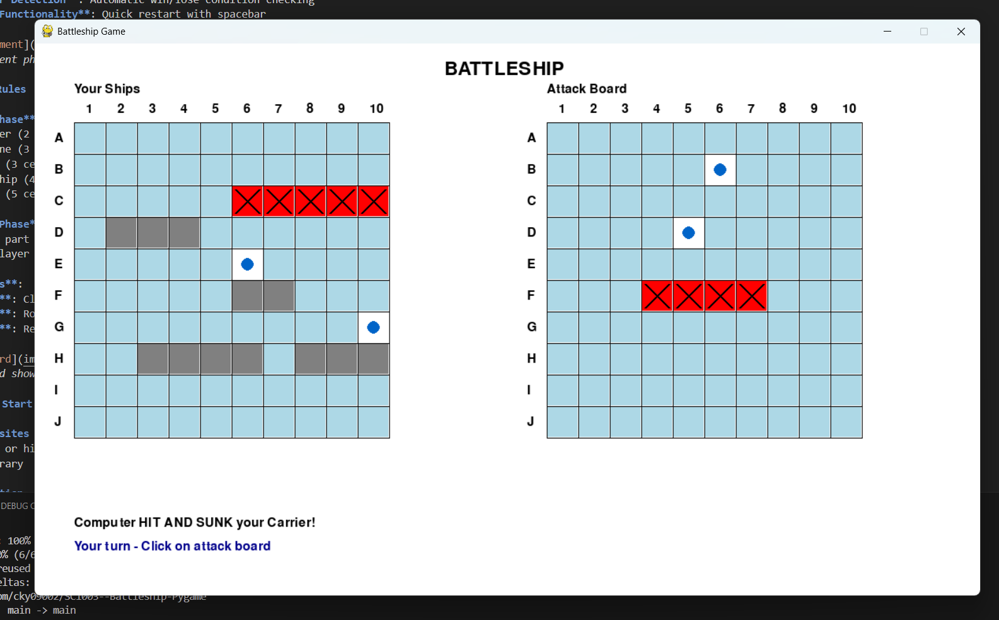

# 🚢 Battleship Game - Pygame Edition

A modern implementation of the classic Battleship game built with Python and Pygame, featuring both console-based and graphical user interface versions.


*Screenshot of the pygame battleship game in action*

## 🎮 Features

- **Visual Pygame Interface**: Interactive GUI with mouse controls
- **Two Game Versions**: Console-based (`todo.py`) and GUI-based (`battleship_pygame.py`)
- **One-Hit Ship Sinking**: Hit any part of a ship to sink the entire vessel
- **Smart Ship Placement**: Visual preview and rotation during setup
- **Attack Tracking**: Separate boards for your ships and attack history
- **Immediate Feedback**: Clear hit/miss indicators and ship destruction notifications
- **Game Over Detection**: Automatic win/lose condition checking
- **Restart Functionality**: Quick restart with spacebar


*Ship placement phase with visual preview*

## 🎯 Game Rules

1. **Setup Phase**: Place 5 ships of varying lengths on your board
   - Destroyer (2 cells)
   - Submarine (3 cells)
   - Cruiser (3 cells)
   - Battleship (4 cells)
   - Carrier (5 cells)

2. **Battle Phase**: Take turns attacking enemy positions
   - Hit any part of a ship to sink the entire ship
   - First player to sink all enemy ships wins

3. **Controls**:
   - **Mouse**: Click to place ships or attack
   - **R Key**: Rotate ship direction during placement
   - **Space**: Restart game after game over


*Attack board showing hits (X) and misses (O)*

## 🚀 Quick Start

### Prerequisites
- Python 3.7 or higher
- Pygame library

### Installation

1. **Clone the repository:**
   ```bash
   git clone https://github.com/cky09002/SC1003--Battleship-Pygame.git
   cd SC1003--Battleship-Pygame
   ```

2. **Install required dependencies:**
   ```bash
   pip install pygame
   ```

3. **Run the game:**
   ```bash
   # For GUI version (recommended)
   python battleship_pygame.py
   
   # For console version
   python todo.py
   ```

## 🎲 Game Versions

### 1. Pygame GUI Version (`battleship_pygame.py`)
- **Interactive Interface**: Point-and-click gameplay
- **Visual Feedback**: Colored cells, animations, and clear indicators
- **Dual Board Display**: Your ships and attack board side-by-side
- **Mouse Controls**: Easy ship placement and attacking

### 2. Console Version (`todo.py`)
- **Text-Based Interface**: Classic terminal gameplay
- **Grid Coordinates**: A-J rows, 1-10 columns
- **Keyboard Input**: Type coordinates to place ships and attack
- **ASCII Art Boards**: Visual representation using characters


*Console version of the battleship game*

## 🛠️ Technical Details

### Game Architecture
- **Object-Oriented Design**: Clean class structure for game logic
- **Separation of Concerns**: Game logic separated from UI rendering
- **Event-Driven**: Pygame event handling for user interactions
- **State Management**: Clear game states (Setup, Playing, Game Over)

### Code Structure
```
├── battleship_pygame.py    # Main pygame GUI version
├── todo.py                # Console-based version
└── README.md             # This file
```

### Key Classes and Methods
- `BattleshipPygame`: Main game class for GUI version
- `BattleshipGame`: Console version game class
- `place_ship()`: Ship placement logic
- `attack()`: Attack handling with one-hit sink mechanic
- `draw_board()`: Pygame rendering for visual boards

## 🎨 Visual Elements

- **Color Coding**:
  - 🔵 Blue: Water/Empty cells
  - ⬜ Gray: Your ships
  - ❌ Red X: Successful hits
  - ⭕ Blue O: Missed attacks
  - 🟡 Yellow: Ship placement preview

- **Board Layout**:
  - Left board: Your ships and enemy attacks
  - Right board: Your attack history
  - Clear coordinate labels (A-J, 1-10)


*Visual guide to game symbols and colors*

## 🎯 Strategy Tips

1. **Ship Placement**:
   - Spread ships apart to make them harder to find
   - Use both horizontal and vertical orientations
   - Avoid predictable patterns

2. **Attack Strategy**:
   - Since ships sink with one hit, focus on coverage rather than completion
   - Use systematic grid patterns for efficient searching
   - Remember that one hit = one ship destroyed

## 🔧 Configuration

You can modify game constants in the code:
- `BOARD_SIZE`: Change grid size (default: 10x10)
- `CELL_SIZE`: Adjust visual cell size in pygame version
- Ship types and lengths in the `ships` dictionary

## 📝 Development

This project was developed as part of SC1003 coursework, demonstrating:
- **Python Programming**: Object-oriented design and game logic
- **Pygame Development**: GUI creation and event handling
- **Algorithm Implementation**: Game state management and AI logic
- **Version Control**: Git and GitHub workflow

## 🤝 Contributing

Feel free to fork this repository and submit pull requests for improvements:
- Bug fixes
- New features (sound effects, animations, etc.)
- Code optimizations
- Additional game modes

## 📜 License

This project is open source and available under the MIT License.

## 📞 Contact

- **Developer**: cky09002
- **Repository**: [SC1003--Battleship-Pygame](https://github.com/cky09002/SC1003--Battleship-Pygame)
- **Course**: SC1003 - Introduction to Computational Thinking

---

**Thank you for checking out this battleship game! 🚢⚓**

*Enjoy sinking some ships and happy coding!* 🎮✨